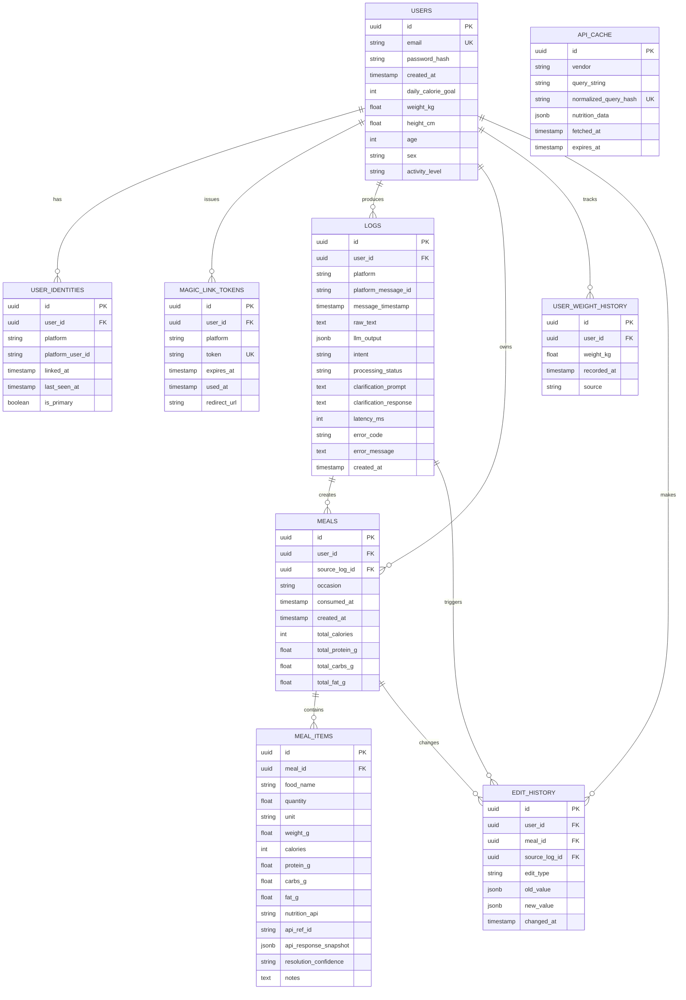

# Calorie Tracker MVP — ERD (Markdown)

**Project:** Natural Language Calorie Tracker (MVP)  
**Date:** 2026-03-14  

This document contains an ERD representation (Mermaid) and a concise description of entities and relationships.

## Mermaid ERD

## Relationship Notes

- **users ↔ user_identities (1:N)**: supports multiple chat platforms per user (Telegram now; WhatsApp/Discord later). Enforces unified profile.
- **users ↔ magic_link_tokens (1:N)**: stores short-lived tokens for linking flows. Tokens are single-use (via `used_at`).
- **users ↔ logs (1:N)**: every incoming message (and optionally web actions) can be recorded for debugging/audit.
- **logs ↔ meals (1:N)**: a single message may create zero, one, or multiple meals (e.g., “breakfast + snack”). `meals.source_log_id` tracks provenance.
- **meals ↔ meal_items (1:N)**: each meal has itemized foods for precise edits and recalculation.
- **users ↔ user_weight_history (1:N)**: preserves weight changes over time.
- **edit_history** links changes back to **user**, **meal**, and optionally the **source_log_id** that triggered the edit.

## Entity Purpose (Quick)

- **USERS**: canonical account + profile + goals.
- **USER_IDENTITIES**: mapping to platform-specific identifiers (e.g., Telegram chat/user id).
- **MAGIC_LINK_TOKENS**: linking and enrollment support across platforms.
- **LOGS**: raw inputs and LLM output for debugging, latency tracking, and error analysis.
- **MEALS**: normalized meal events (time + occasion + totals).
- **MEAL_ITEMS**: per-food item details, including nutrition API resolution metadata.
- **API_CACHE**: caches vendor results to reduce cost/latency.
- **USER_WEIGHT_HISTORY**: longitudinal weight data.
- **EDIT_HISTORY**: audit trail + undo support.
